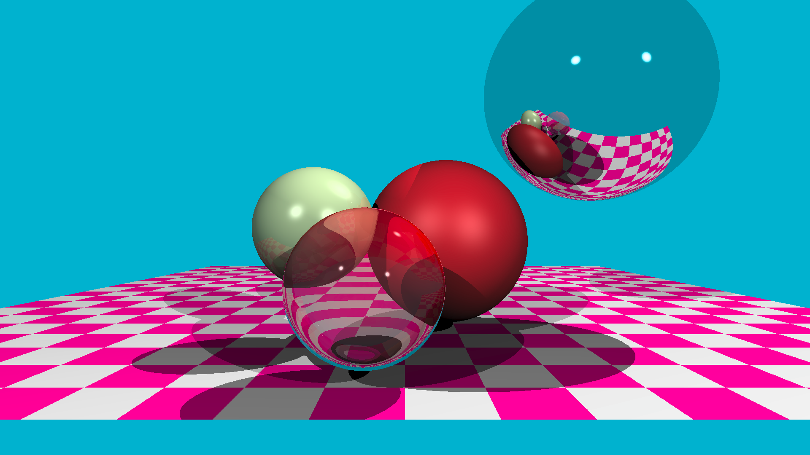
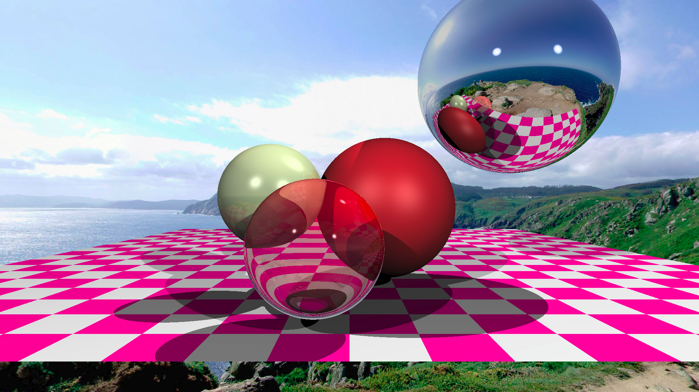

# C++ Basic Raytracer

This is a very basic Raytracer written in C++ following this article : [tinyraytracer](https://github.com/ssloy/tinyraytracer/wiki/Part-1:-understandable-raytracing)

It uses OpenMP to speed up the generation

## Screenshot

## Todo
- [x] Add the base plane in the scene
- [x] Use a spherical picture as a background
